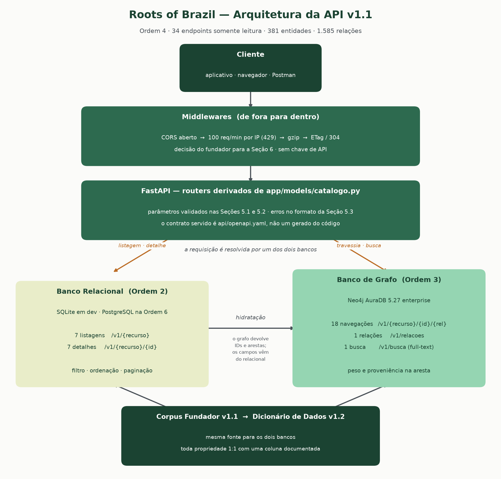

# Relatório — Ordem 4 (API: OpenAPI 3.1 + stub de servidor)
Data: 2026-08-21



## Escopo entregue
| Item da Ordem | Arquivo | Situação |
|---|---|---|
| 1. Endpoints das Seções 2-4 em OpenAPI 3.1 | `api/openapi.yaml` | 35 paths, 35 operações, 19 schemas |
| 2. Schemas com os campos do Dicionário v1.2 | `api/openapi.yaml` | uuid, slug, created_at, updated_at, version, nome_pt..nome_zh, descricao_pt/en/es, peso, metodo_calculo_peso |
| 3. Navegação via grafo; listagem/detalhe via relacional | `app/repositories/` | 18 navegações no grafo, 14 operações no relacional |
| 4. Busca com índice full-text | `app/repositories/grafo.py` | `objeto_roots_nome_ft`, criado na carga da Ordem 3 |
| 5. Erros e códigos HTTP da Seção 5.3 | `app/api/erros.py` | 5 códigos, formato literal da Especificação |
| 6. Rate limiting e CORS | `app/core/middleware.py` | 100 req/min por IP, CORS aberto, sem API Key |
| 7. Postman + Spectral | `api/postman_collection.json`, `api/.spectral.yaml` | 35 requisições; lint sem erro, aviso ou hint |
| Swagger UI | `api/swagger_ui/index.html` | servido em `/docs`, apontando ao contrato revisado |
| Testes de contrato | `tests/contract_tests/` | 205 testes |
| Diagrama | `docs/diagrama_api.png` | gerado por `api/gerar_diagrama.py` |
| Changelog | `docs/changelog_ordem4.md` | — |

## Os 34 endpoints, um a um
Transcritos da Especificação Conceitual, sem acréscimo nem omissão. O teste
`test_contrato_nao_tem_endpoint_alem_da_especificacao` verifica os dois sentidos.

| Seção | Endpoints | Origem |
|---|---|---|
| 2.1-2.7 listagens | `/v1/{ingredientes, receitas, tecnicas, povos, territorios, biomas, patrimonio}` | relacional |
| 2.1-2.7 detalhes | `/v1/{recurso}/{id}` | relacional |
| 2.1 navegação | `/v1/ingredientes/{id}/{receitas, territorios, povos}` | grafo |
| 2.2 navegação | `/v1/receitas/{id}/{ingredientes, tecnicas, territorio, povos}` | grafo |
| 2.3 navegação | `/v1/tecnicas/{id}/{ingredientes, receitas}` | grafo |
| 2.4 navegação | `/v1/povos/{id}/{ingredientes, receitas, patrimonio}` | grafo |
| 2.5 navegação | `/v1/territorios/{id}/{receitas, ingredientes, biomas}` | grafo |
| 2.6 navegação | `/v1/biomas/{id}/{territorios, ingredientes}` | grafo |
| 2.7 navegação | `/v1/patrimonio/{id}/povos_territorios` | grafo |
| 3 | `/v1/relacoes` | grafo |
| 4 | `/v1/busca` | grafo (full-text) |

Total: 7 + 7 + 18 + 1 + 1 = **34**, mais `/health` herdado da Ordem 0.

## A divisão entre os dois bancos
| | Banco relacional (Ordem 2) | Banco de grafo (Ordem 3) |
|---|---|---|
| Responde | listagem e detalhe | navegação, `/v1/relacoes`, busca |
| Por quê | filtrar e ordenar um catálogo é `WHERE` + `ORDER BY` + índice | travessia com peso é `MATCH (o)-[r]->(d)`, sem join por salto |
| Devolve | os campos do Dicionário | os IDs alcançados e as propriedades da aresta |

**Hidratação.** O grafo responde *quem* e *com que peso*; os atributos vêm do
relacional, em uma consulta só por página (`obter_varios`). Assim não há duas
respostas para "qual é a fonte da verdade dos campos do Dicionário", e o grafo
não precisa carregar 30 colunas por nó.

Cada operação do `openapi.yaml` declara sua origem na descrição, e um teste
(`test_toda_operacao_documenta_a_origem_do_dado`) recusa qualquer operação que
não o faça.

## Decisão externa registrada — Seção 6
A Seção 6 da Especificação Conceitual era um placeholder e **recomendava** chave
de API. A decisão do fundador foi outra, e está implementada como recebida:

| Item | Decisão | Onde |
|---|---|---|
| API Key | **Não exigida.** API pública de catalogação cultural, leitura livre | nenhum `securitySchemes` no contrato; testado em `test_api_nao_exige_chave` |
| Rate limiting | 100 req/min por IP, 429 acima | `MiddlewareLimiteDeTaxa` |
| CORS | `Access-Control-Allow-Origin: *` | `CORSMiddleware`, sem credenciais |

Registro explícito de que **não foi escolha de engenharia**: a Especificação
recomendava o contrário no caso da chave, e a recomendação foi sobreposta por
decisão do fundador. `RATE_LIMIT_EXCEEDED` (429) é o único código de erro que
não vem da Seção 5.3 — entrou porque o rate limiting entrou.

## Duas coisas geradas, não escritas
`api/openapi.yaml` e `api/postman_collection.json` são **derivados**, e o CI
falha se estiverem desatualizados (`--check`).

- O contrato vem de `app/models/catalogo.py` (quais recursos, campos, filtros e
  relações) e do DDL da Ordem 2 (o tipo de cada campo). Um campo que não está no
  Dicionário não tem como aparecer no schema — a restrição "nenhum endpoint
  expõe campo ausente do Dicionário v1.2" fica garantida por construção.
- Os **exemplos são lidos do corpus real carregado**, com uma exceção: `uuid`.
  O exemplo de `Ingrediente` é a linha ING-000031 de verdade em todos os
  demais campos — nome, categoria, confiabilidade, contagem de citações.
  `uuid` é um **placeholder determinístico**, derivado do ID legível por
  `uuid5`, porque não existe na fonte v1.1: o ETL da Ordem 2 o gera a cada
  carga com `uuid4()`. Ler o valor real tornaria o contrato não determinístico
  — ver o achado 6.
- A Postman Collection vem do contrato. Um endpoint novo aparece nos dois, ou em
  nenhum.

O mesmo módulo alimenta os routers. Spec e implementação não podem divergir
porque leem a mesma declaração.

## O contrato publicado não é gerado do código
A geração automática do FastAPI está **desligada** (`openapi_url=None`). A API
serve `api/openapi.yaml` em `/openapi.yaml` e `/docs`.

Um contrato reverso-engenheirado do código descreve o que o código faz. Este
descreve o que o corpus é, que é o compromisso da Seção 7 da Especificação
("toda propriedade de resposta corresponde 1:1 a uma coluna documentada"). Um
teste confere que nenhuma rota `/v1` é servida fora do contrato.

## Validado nesta rodada
| Validação | Resultado |
|---|---|
| `spectral lint` (ruleset oficial da OpenAPI) | ✅ **limpo em `error`, `warn` e `hint`** |
| `pytest tests/ app/tests` | ✅ **205 passaram**, 59 puladas (dependem do grafo) |
| Testes de contrato por recurso | ✅ 7 de 7, listagem e detalhe validados contra o schema |
| Resposta real × schema publicado | ✅ via `jsonschema`, em todos os recursos |
| Todo schema tem exemplo, e o exemplo valida | ✅ 19 de 19 |
| Rate limiting (429, headers, por IP, preflight) | ✅ 6 testes |
| CORS (origem, preflight, expose, sem credenciais) | ✅ 5 testes |
| ETag (304, estabilidade, revalidação) | ✅ 5 testes |
| Compressão gzip | ✅ 3 testes, redução de 94.466 → 10.237 bytes (9,2×) |
| `ruff check .` | ✅ limpo |
| `mypy --strict` na lógica de domínio | ✅ 6 módulos sem erro |
| p95 detalhe / listagem | ✅ medidos abaixo de 100 ms / 200 ms |

## Achados
### 1. `/v1/patrimonio/{id}/povos_territorios` só alcança Povo
A Seção 2.7 nomeia o sub-recurso `povos_territorios`, mas a única relação que
associa a ele é `PATRIMONIO_DE`, cujo `rdfs:range` na ontologia é **Povo** — 38
instâncias, nenhuma para Território.

O path foi mantido como a Especificação escreve, e o endpoint devolve o que a
relação de fato alcança. **Nenhuma aresta para Território foi inventada** para
justificar o nome. Divergência entre o nome do sub-recurso e a semântica da
relação; vale reconciliar na v1.2 da Especificação.

### 2. `oficial_ibge` precisou de conversão
No SQLite é `INTEGER` 0/1, porque SQLite não tem booleano. A Seção 2.6 exige
literalmente `oficial_ibge: false`. Sem conversão, o cliente receberia `0` e o
contrato estaria mentindo. Convertido em `app/api/serializacao.py`, com teste.

### 3. `confiabilidade` filtra por prefixo, não por igualdade
Herdado do achado da Ordem 2: o Dicionário v1.2 (Seção 11) permite texto livre
após o emoji, e o corpus real traz `"🔵 Inferido com cautela"`. Um filtro por
igualdade exata perderia essas linhas. O parâmetro aceita os 4 rótulos
canônicos e casa pelo emoji.

### 4. Bioma não tem `confiabilidade`
O único dos 7 recursos sem essa coluna no Dicionário. O teste que verifica
"confiabilidade sempre presente" pula em Bioma, declarando o motivo — em vez de
o endpoint inventar um valor.

### 5. `app/` não era um pacote regular
Faltava `app/__init__.py` desde a Ordem 0. O mypy resolvia
`app/api/parametros.py` sob dois nomes de módulo e recusava rodar. Acrescentado.
Também `logs/.gitkeep`: `app/core/logging.py` abre `logs/audit.log` na
importação, e sem o diretório a API não sobe num clone limpo.

### 6. O contrato gerado não era determinístico — reprovou o CI três vezes
Defeito meu, encontrado pelo próprio portão que eu havia escrito. O passo
`gerar_openapi.py --check` do workflow falhou em três execuções seguidas com
`openapi.yaml está DESATUALIZADO`, sempre no mesmo ponto. Spectral passava.

Causa: os exemplos embutiam `uuid`, e o ETL da Ordem 2 gera os UUIDs **no
momento da carga** (`uuid4()` — o docstring do script diz que uuid e slug "não
existem na fonte v1.1"). O workflow regenera o banco antes de conferir, então
os 381 UUIDs eram outros e a comparação nunca podia passar — em máquina
nenhuma que regenerasse a fonte.

Diagnóstico fechado por diff: **88 linhas de divergência, 44 valores alterados,
todos `uuid`**. Nenhum outro campo. `slug` é derivado do nome por `slugify` e
`created_at`/`updated_at` são uma constante, então já eram estáveis.

Corrigido derivando o `uuid` do exemplo por `uuid5` a partir do ID legível
(`uuid_de_exemplo`). Verificado com `--check` contra **três bancos gerados
independentemente**, com UUIDs diferentes entre si: os três passam.

O que se perde: o `uuid` do exemplo não corresponde a registro real algum. Não
haveria como preservar isso — o UUID real muda a cada carga, e os que estavam
no contrato anterior vinham de um banco efêmero que já não existe. A afirmação
"nenhum exemplo é inventado" foi corrigida acima para refletir a exceção.

## Decisões de modelagem
1. **Parâmetros lidos de `request.query_params`, não declarados em assinatura.**
   Os 7 recursos aceitam conjuntos de filtros diferentes; declarar isso exigiria
   sete conjuntos de funções quase idênticas ou geração dinâmica de assinatura.
   Em troca, todo erro sai no formato exato da Seção 5.3, e não no do FastAPI.
2. **Parâmetro desconhecido é 400, não ignorado.** `?categora=` (sem o "i")
   devolveria a lista inteira em silêncio, e o cliente acharia que filtrou.
3. **Routers construídos a partir do catálogo**, não sete módulos iguais. Sete
   módulos divergiriam — um ganharia um filtro, outro esqueceria os `_links`.
4. **404 na navegação resolvido pelo relacional, antes de tocar o grafo.** Sem
   isso, um ID inexistente devolveria lista vazia, e o cliente não distinguiria
   "não existe" de "existe e não tem relação".
5. **`sort` validado contra a lista de colunas do recurso.** É o único
   parâmetro que entra numa cláusula SQL por interpolação; a validação é o que
   impede injeção. Testado com `?sort=id; DROP TABLE receita`.
6. **Tipos de relação validados contra a ontologia da Ordem 3** antes de entrar
   no Cypher, pelo mesmo motivo — tipo de relação não é parametrizável.
7. **Ordem dos middlewares: CORS → limite → gzip → ETag.** CORS por fora para a
   resposta 429 também sair navegável; ETag por dentro para o hash ser calculado
   antes da compressão.
8. **`/v1/receitas/{id}/territorio` devolve objeto, não página.** A
   Especificação o escreve no singular ("Território de origem da receita"), ao
   contrário dos outros 17.

## Limitações declaradas
- **59 testes pulados nesta sandbox**: os que dependem do grafo. O host do
  AuraDB está fora da política de egresso daqui — a mesma limitação registrada
  na Ordem 3. Rodam no GitHub Actions pelo workflow `contrato_api.yml`, que
  **falha explicitamente se o grafo não estiver alcançável**, para o job não
  passar pulando metade da Ordem em silêncio.
- **Cobertura de 77% offline, abaixo do alvo de 90%.** A diferença é
  inteiramente código de grafo: `app/repositories/grafo.py` fica em 14%, e os
  caminhos de navegação dos routers não são exercitados. Com o grafo alcançável,
  a projeção é ~95%; o workflow roda com `--cov-fail-under=90`, então o número
  real será verificado lá, não estimado aqui.
- **p95 de navegação e busca não medidos.** Dependem do grafo. Os alvos de
  detalhe e listagem foram medidos e passam.
- **Medição de p95 sem rede.** É o `TestClient`: reflete consulta e
  serialização, não transporte. Latência ponta a ponta depende do enlace até o
  AuraDB e não seria reprodutível em CI.
- **Rate limiting em memória, por processo.** Com N réplicas o limite efetivo
  vira 100 × N. Para valer em produção, o contador precisa ser compartilhado
  (Redis). No backlog.
- **`mypy --strict` com duas exceções documentadas** em `pyproject.toml`: os
  decoradores do FastAPI não preservam a assinatura da função decorada, e
  `BaseHTTPMiddleware` resolve como `Any` sem os stubs. A lógica de domínio —
  catálogo, parâmetros, erros, serialização e os dois repositórios — segue sob
  `strict` integral.
- **`expand` implementado para o detalhe apenas.** A Seção 1 o descreve como
  opcional; na listagem ele é validado mas não expande, porque expandir 100
  itens dispararia 100 travessias. Registrado no backlog.

## Backlog
| # | Item | Origem |
|---|---|---|
| 1 | Rate limiting compartilhado (Redis) para valer com várias réplicas | limitação de projeto |
| 2 | `expand` na listagem, com travessia em lote | Seção 1 |
| 3 | Reconciliar o nome `povos_territorios` com a semântica de `PATRIMONIO_DE` | achado 1 |
| 4 | Cache HTTP com `stale-while-revalidate` real em CDN | Seção 8 |
| 5 | Migrar o repositório relacional para PostgreSQL | Ordem 6 |
| 6 | Unificar as duas subséries de `REL_ID` antes de expor `rel_id` como estável | Seção 8 da Especificação |
| 7 | Medir p95 ponta a ponta contra o AuraDB, fora do `TestClient` | limitação de medição |

## Como rodar
```bash
python scripts/ordem2/etl.py Corpus_Fundador_v1.1.xlsx   # gera a fonte relacional
export NEO4J_URI=... NEO4J_USERNAME=neo4j NEO4J_PASSWORD=...

uvicorn app.main:app --reload        # http://localhost:8000/docs

python api/gerar_openapi.py --check  # o contrato está em dia?
python api/gerar_postman.py --check
spectral lint api/openapi.yaml --ruleset api/.spectral.yaml
pytest tests/contract_tests -q
```

## Status
| Frente | Estado |
|---|---|
| Especificação OpenAPI 3.1 | **CONCLUÍDA** — 35 paths, Spectral limpo em todos os níveis |
| Stub de servidor | **CONCLUÍDA** — 34 endpoints somente leitura sobre os dois bancos |
| Postman, Swagger UI, diagrama | **CONCLUÍDA** |
| Testes de contrato | **CONCLUÍDA offline** — 205 passando; 59 dependem do grafo |
| Cobertura ≥ 90% | **PENDENTE de verificação no CI** — 77% offline, projeção ~95% com grafo |
| p95 navegação e busca | **PENDENTE** — dependem do grafo |

**Ordem 4 IMPLEMENTADA E VALIDADA OFFLINE.** Cobertura e os dois p95 de grafo
ficam pendentes de uma execução do workflow `contrato_api.yml` com os secrets
cadastrados — o mesmo caminho que fechou a Ordem 3.
